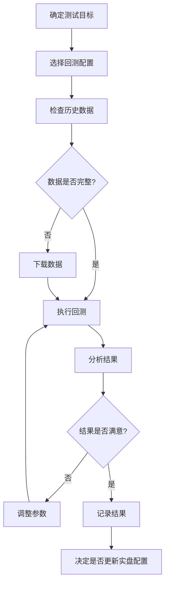

# Freqtrade 回测操作规范

> 简洁实用的回测标准流程 - 5分钟快速上手

## 📌 核心原则

**🚨 黄金法则：回测配置与实盘配置完全独立，永远不要混用！**

```
实盘配置 (config-custom.json)      ← 生产环境，禁止修改用于回测
回测配置 (config-backtest-*.json) ← 测试环境，独立管理
```

---

## 🚀 快速开始(3步)

### 步骤1: 检查数据

```bash
source .venv/bin/activate
freqtrade list-data --show-timerange | grep "5m.*futures" | head -5
```

确保有足够的历史数据(至少1个月)。

### 步骤2: 运行回测

```bash
# 使用已创建的回测配置
freqtrade backtesting \
  --config user_data/config-backtest-realistic.json \
  --timerange 20241008-20241108 \
  --cache day \
  --export trades
```

### 步骤3: 查看结果

回测完成后，终端会显示完整报告。重点关注：
- **Total profit %** - 总收益率
- **Win%** - 胜率
- **Drawdown** - 最大回撤
- **Sharpe** - 夏普比率(>1为好)

---

## ⚙️ 回测配置文件要求

### 必需字段

```json
{
  "strategy": "NostalgiaForInfinityX7",

  "dry_run": true,                    // 必须true
  "dry_run_wallet": 10000,            // 初始资金

  "max_open_trades": 11,              // 最大仓位
  "stake_amount": "unlimited",        // 资金分配

  "trading_mode": "futures",          // 期货模式
  "margin_mode": "isolated",          // 逐仓

  "exchange": {
    "name": "binance",
    "pair_whitelist": [               // 静态交易对列表
      "BTC/USDT:USDT",
      "ETH/USDT:USDT",
      ...
    ]
  },

  "pairlists": [
    { "method": "StaticPairList" }    // 必须用静态列表
  ],

  "order_types": {
    "stoploss_on_exchange": false     // 回测不支持
  }
}
```

### 可选字段(推荐)

```json
{
  "fee": 0.0004,                      // 手续费(0.04%)
  "funding_fee_offset": -8,           // 资金费率

  "NostalgiaForInfinityX7": {
    "leverage_num": 14                // 杠杆倍数
  },

  "nfi_parameters": {
    "futures_max_open_trades_long": 10,
    "futures_max_open_trades_short": 1
  }
}
```

---

## 📝 常用回测命令

### 基础回测

```bash
# 最近1个月
freqtrade backtesting \
  --config user_data/config-backtest-realistic.json \
  --timerange 20241008-20241108

# 最近3个月
freqtrade backtesting \
  --config user_data/config-backtest-realistic.json \
  --timerange 20240808-20241108

# 自定义时间段
freqtrade backtesting \
  --config user_data/config-backtest-realistic.json \
  --timerange 20240101-20240630
```

### 高级选项

```bash
# 启用缓存(第二次运行更快)
--cache day

# 导出交易记录
--export trades

# 按月统计
--breakdown month

# 使用详细时间框架(更精确,但更慢)
--timeframe-detail 1m
```

---

## 📊 结果解读

### 重点指标说明

| 指标 | 含义 | 优秀标准 |
|------|------|----------|
| **Total profit %** | 总收益率 | > 5% (月度) |
| **Win%** | 胜率 | > 60% |
| **Drawdown** | 最大回撤 | < 10% |
| **Sharpe** | 风险调整收益 | > 1.5 |
| **Profit factor** | 盈亏比 | > 1.5 |
| **SQN** | 系统质量 | > 1.6 (好), > 2.0 (优秀) |

### 实际案例解读

```
本次回测结果(2024-10-08 至 2024-11-08):
├─ Total profit %: 9.44%          ✅ 优秀(月度9.44%)
├─ Trades: 13                     ✅ 交易频率适中
├─ Win%: 92.3% (12胜1负)          ✅ 胜率很高
├─ Drawdown: 2.63%                ✅ 回撤很小
├─ Sharpe: 5.37                   ✅ 极佳
├─ Best trade: +63.16%            ⚠️  单笔收益过高
└─ Worst trade: -83.58%(爆仓)     ❌ 风险警告!
```

**⚠️ 风险提示**：
- 有1笔爆仓交易(APT -83.58%) - 需要检查止损设置
- 最佳交易收益63.16% - 可能是策略参数过于激进

---

## ⚠️ 常见错误与解决

### 错误1: 动态pairlist不支持

```bash
❌ Pairlist Handlers VolumePairList do not support backtesting.
```

**解决**：使用静态交易对列表
```json
{
  "exchange": {
    "pair_whitelist": ["BTC/USDT:USDT", ...]
  },
  "pairlists": [
    { "method": "StaticPairList" }
  ]
}
```

### 错误2: 缺少exit_pricing配置

```bash
❌ KeyError: 'exit_pricing'
```

**解决**：添加entry_pricing和exit_pricing配置(参考上方必需字段)

### 错误3: 网络超时

```bash
❌ RequestTimeout: binance GET https://api.binance.com/api/v3/exchangeInfo
```

**解决**：在配置文件中添加`config-private.json`(包含代理配置)
```json
{
  "add_config_files": [
    "...",
    "config-private.json"  // 加载代理设置
  ]
}
```

或者设置环境变量:
```bash
export http_proxy=http://127.0.0.1:7897
export https_proxy=http://127.0.0.1:7897
```

### 错误4: 黑名单未生效，风险币种仍在交易 🆕

```bash
⚠️  回测中发现SOL、MAGIC、GMX等高风险币种仍在交易
```

**问题**：回测配置中使用了本地`pair_blacklist`，与全局黑名单不一致

**诊断方法**：
```bash
# 1. 检查回测结果中的交易对
grep "pair" user_data/backtest_results/backtest-result-*.json | sort -u

# 2. 验证黑名单是否包含风险币种
grep -E "(SOL|MAGIC|GMX|NEAR|PENDLE)" configs/blacklist-binance.json
```

**解决**：删除回测配置中的本地黑名单，统一使用全局黑名单
```json
// ❌ 错误配置
{
  "exchange": {
    "pair_whitelist": [...],
    "pair_blacklist": [...]  // 删除这个
  }
}

// ✅ 正确配置
{
  "add_config_files": [
    "../configs/blacklist-binance.json"  // 使用全局黑名单
  ],
  "exchange": {
    "pair_whitelist": [...]
  }
}
```

**验证黑名单生效**：
```bash
# 运行回测后，检查交易对列表
freqtrade backtesting --config user_data/config-backtest.json \
  --timerange 20241101-20241108 | grep "Backtesting with data"

# 确认SOL、BNB、MAGIC、GMX、NEAR、PENDLE等未出现在交易列表中
```

### 错误5: 内存不足(大规模回测) 🆕

```bash
❌ free(): invalid next size (fast)
❌ Exit code 134 (SIGABRT - Memory allocation failure)
```

**问题**: 回测大量币对(60+)或长时间周期(6个月+)时,内存溢出导致进程崩溃

**原因分析**:
- NostalgiaForInfinityX7策略计算5个时间框架指标(5m/15m/1h/4h/1d)
- 每个币对需要800根启动K线 + 回测期间所有K线
- 内存需求: `币对数 × 时间框架数 × K线数 × 指标数`
- 示例: 63币对 × 5时间框架 × 3个月数据 ≈ 超出可用内存

**诊断方法**:
```bash
# 监控内存使用情况
watch -n 1 free -h

# 检查回测进程是否被OOM killer杀死
dmesg | grep -i "out of memory"
```

**解决方案**:

**方案1: 分批回测(推荐)** ⭐
将大量币对分成多批,每批20-30个币对:
```bash
# 第1批: 主流币(BTC, ETH, BNB等)
freqtrade backtesting \
  --config user_data/config-backtest-batch1.json \
  --timerange 20250808-20251108

# 第2批: 中型市值币
freqtrade backtesting \
  --config user_data/config-backtest-batch2.json \
  --timerange 20250808-20251108

# 第3批: 小型市值币
freqtrade backtesting \
  --config user_data/config-backtest-batch3.json \
  --timerange 20250808-20251108
```

**方案2: 缩短时间范围**
```bash
# 6个月 → 1个月
freqtrade backtesting \
  --config user_data/config-backtest-69pairs.json \
  --timerange 20251008-20251108  # 仅1个月
```

**方案3: 精选币对**
从69个币对中挑选30-40个最重要的:
```json
{
  "exchange": {
    "pair_whitelist": [
      "BTC/USDT:USDT",
      "ETH/USDT:USDT",
      // ... 仅保留30-40个主流币
    ]
  }
}
```

**内存优化建议**:
- ✅ 使用 `--cache day` 避免重复计算指标
- ✅ 关闭不必要的应用程序释放内存
- ✅ 使用 `--timeframe-detail` 时要特别小心(大幅增加内存)
- ❌ 避免同时运行多个回测进程
- ❌ 避免回测期间运行内存密集型应用(浏览器、IDE等)

**实际案例(2025-11-08)**:
```
回测配置: 63个币对 × 12倍杠杆 × 6个月数据
策略: NostalgiaForInfinityX7 (需5个时间框架)
结果: 内存溢出崩溃(Exit code 134)
解决: 改为分批回测,每批20-25个币对
```

---

## 📁 文件管理规范

### 当前配置文件结构

```
user_data/
├── config-custom.json                     # ❌ 实盘主配置(禁止修改用于回测)
├── config-private.json                    # ❌ API密钥配置(禁止修改)
├── config-backtest-realistic.json         # ✅ 标准回测配置(20个币对)
└── backtest_results/                      # 回测结果自动保存
    └── backtest-result-*.json

configs/                                   # 模块化配置目录
├── blacklist-binance.json                 # 黑名单(实盘+回测共用)
├── pairlist-backtest-top20.json           # 回测静态币对(20个)
├── pairlist-volume-binance-usdt.json      # 实盘动态币对(~80个)
└── trading_mode-futures.json              # 期货模式配置
```

### 配置文件说明

| 文件 | 用途 | 是否可修改 | 备注 |
|------|------|-----------|------|
| `config-custom.json` | 实盘主配置 | ⚠️ 仅实盘调参时修改 | 加载全局黑名单 |
| `config-private.json` | API密钥和代理 | ⚠️ 仅更换密钥时修改 | - |
| `config-backtest.json` | 回测配置 | ✅ 可以修改测试参数 | 🆕 已删除本地黑名单 |
| `configs/blacklist-binance.json` | 全局黑名单 | ✅ 可添加/删除币对 | 🆕 实盘+回测共用 |
| `configs/pairlist-*.json` | 币对列表 | ✅ 可调整币对 | - |
| `configs/trading_mode-futures.json` | 期货设置 | ❌ 通常不需要修改 | - |

**🆕 重要更新 (2025-11-08)**:
- ✅ 删除了`config-backtest.json`中的本地`pair_blacklist`
- ✅ 统一使用`configs/blacklist-binance.json`全局黑名单
- ✅ 实盘和回测现在使用完全相同的黑名单规则
- ✅ 黑名单包含8条规则，覆盖240+问题币种（BNB、SOL、MAGIC、GMX、NEAR、PENDLE等）

---

## 🎯 回测工作流程



### 标准工作流

1. **准备阶段**
   - 确定测试目标(例如:测试不同杠杆)
   - 选择或创建回测配置
   - 确认数据完整性

2. **执行阶段**
   - 运行回测命令
   - 等待完成(1个月数据约需1-2分钟)
   - 保存结果文件

3. **分析阶段**
   - 查看关键指标
   - 识别风险点(爆仓、大额亏损)
   - 对比不同参数结果

4. **决策阶段**
   - 评估是否满足预期
   - 决定是否修改实盘配置
   - 记录测试结论

---

## 💡 最佳实践

### ✅ 推荐做法

1. **始终使用独立回测配置**
   ```bash
   ✅ freqtrade backtesting --config user_data/config-backtest-realistic.json
   ❌ freqtrade backtesting --config user_data/config-custom.json
   ```

2. **统一使用全局黑名单配置** 🆕
   ```json
   // ✅ 推荐：在add_config_files中加载全局黑名单
   {
     "add_config_files": [
       "../configs/trading_mode-futures.json",
       "../configs/blacklist-binance.json"  // 全局黑名单
     ],
     "exchange": {
       "pair_whitelist": [...]
       // ❌ 不要在这里添加本地pair_blacklist
     }
   }
   ```

   **优势**：
   - ✅ 实盘和回测使用相同的黑名单规则
   - ✅ 只需在一个地方维护黑名单
   - ✅ 避免配置不一致导致的风险

   **验证黑名单是否生效**：
   ```bash
   # 运行回测后检查实际交易的币种
   # 确保BNB、SOL、MAGIC、GMX、NEAR、PENDLE等风险币种未被交易

   # 示例：即使whitelist中包含SOL/USDT:USDT
   # 全局黑名单会自动过滤，最终不会交易SOL
   ```

3. **测试多个时间段**
   ```bash
   # 测试牛市
   --timerange 20240101-20240331

   # 测试震荡市
   --timerange 20240701-20240930
   ```

4. **对比不同参数**
   - 创建多个配置文件
   - 使用`--strategy-list`对比多个策略
   - 记录每次测试的结果

5. **启用缓存节省时间**
   ```bash
   --cache day  # 第一次运行
   --cache day  # 第二次运行(使用缓存)
   ```

### ❌ 避免做法

1. **不要修改实盘配置文件用于回测**
2. **不要在回测配置中使用本地黑名单** 🆕
   ```json
   // ❌ 错误示例
   {
     "exchange": {
       "pair_blacklist": [
         "INJ/USDT:USDT",
         "XRP/USDT:USDT"
       ]
     }
   }
   ```
   **原因**：本地黑名单会导致实盘和回测配置不一致，应统一使用全局黑名单。

3. **不要依赖单次回测结果**
4. **不要忽略爆仓和大额亏损**
5. **不要在回测中使用动态pairlist**

---

## 📖 快速参考卡

### 一行命令回测

```bash
# 复制粘贴即可运行(修改时间范围)
source .venv/bin/activate && \
freqtrade backtesting \
  --config user_data/config-backtest-realistic.json \
  --timerange 20241008-20241108 \
  --cache day \
  --export trades
```

### 关键文件位置

- **回测配置**: `user_data/config-backtest-realistic.json`
- **实盘配置**: `user_data/config-custom.json` (禁止用于回测)
- **回测结果**: `user_data/backtest_results/`
- **默认策略**: `user_data/strategies/NostalgiaForInfinityX7.py`
- **模块配置**: `configs/` (黑名单、币对列表等)

### 重要参数

- `--timerange`: 时间范围(YYYYMMDD-YYYYMMDD)
- `--cache`: 缓存设置(none/day/week/month)
- `--export`: 导出选项(none/trades/signals)
- `--breakdown`: 统计周期(day/week/month/year)

---

## 📚 相关文档

- [官方回测文档](https://www.freqtrade.io/en/stable/backtesting/)
- [CONFIG_STANDARDS.md](CONFIG_STANDARDS.md) - 配置规范
- [LIVE_TRADING_CONFIG_ANALYSIS.md](LIVE_TRADING_CONFIG_ANALYSIS.md) - 实盘配置分析
- [FreqAI_工作日志.md](FreqAI_工作日志.md) - 项目工作记录

---

## 📝 配置清理说明

本项目已完成配置文件清理(2025-11-08):
- ✅ 删除了12个冗余配置文件
- ✅ 删除了2个冗余目录
- ✅ 保留了7个核心配置文件
- ✅ 实现了实盘/回测配置完全分离

**清理原则**:
1. 实盘配置(2个): `config-custom.json` + `config-private.json`
2. 回测配置(1个): `config-backtest.json`
3. 模块配置(4个): 黑名单、币对列表、期货设置

---

## 📋 更新日志

### v1.2 (2025-11-08)
- 🆕 添加黑名单配置最佳实践
- 🆕 删除回测配置中的本地黑名单
- 🆕 统一使用全局黑名单（实盘+回测）
- 🆕 添加黑名单验证方法
- 🆕 新增"错误4: 黑名单未生效"处理指南

### v1.1 (2025-11-08)
- 完成配置文件清理
- 实现实盘/回测配置完全分离

---

**最后更新**: 2025-11-08
**文档版本**: v1.2
**回测版本**: Freqtrade 2025.11-dev
**配置优化**: 黑名单统一化 ✅
